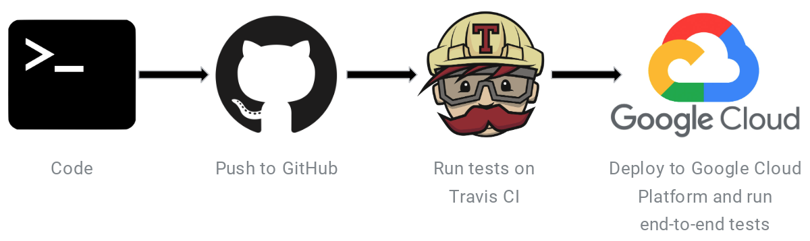

# Design Detail
## Approach
[//]: # (## 2.1. Initial	documentation D1)
[//]: # (1. Describe how	you	intend	to	develop	the	API	module and	provide	the	ability to	run	it	in	Web	service	mode)
Before producing our API module design, we studied some of the relevant concepts in our problem domain. During this process, we will establish the domain model and sort out the relationships. Our resulting API modules will be designed based on our problem domain. We will build and display the API documentation within the Swagger editor, which will finally be developed in our designated platform and frameworks.

All the required handlers will be created for each of our API modules. Each API module will run in REST web service mode and will handle the corresponding REST request. Our web server will be built and host on the Google cloud platform, using a low cost App Engine Standard Environment. The EpiPro Application will then be able to serve REST API requests 24/7. More details on the Google App Engine is available [here](https://cloud.google.com/appengine/docs/).

## API Design Module
[//]: # (2. Discuss	your	current	thinking	about	how	parameters can	be	passed	to	your module	and	how	results	are	collected.	Show	an	example	of	a	possible interaction .e.g.- sample	HTTP	calls	with	URL	and	parameters)
### APIs Design
After brainstorming about the query parameters, studying the usage of the disease report for the API and refering to the specification requirements, we have concluded upon the REST API list below. The user is able to fetch and filter disease reports based on these three information queries:

#### Period of Interest
This refers to what specific time period the user is interested in for the disease report retrieval. We have two main APIs involved in this process. The first one helps retrieve all disease reports from the database, where the parameters are related to pagination e.g. start, limit. The second one helps filter by specific period in time, which can be passed to this module using the parameters indicating the beginning and/or end of this period e.g. start-date and end-date. Other optional parameters a filter by given keyterms or location.

#### Keyterms
The main API involving keyterms involves the category parameter, which helps group the keyterms given by the project specification. This parameter can only be given two values - 'general' or 'specific'. The API responds by returning general or specific keyterms, as outlined in the project specification.

#### Location
Location helps the user restrict the disease reports to a designated geographical location. Two main APIs are involved with this. The first one will return all locations mentioned in disease reports, with no additional input query parameter required. The second one accepts a parameter of the geonameID, and will respond with detailed information corresponding to the given geogrphical ID.

More details on the APIs structure available [here](https://epiproapp.appspot.com/api/v1/doc/) on the EpiPro Online Documentation.

### Collect Disease Reports
As our data source WHO is a dynamic website which also provides search and filter functionalities, we chose Selenium and Scrapy frameworks to build and define our web scraper, even though there are lots of other great choice for web scraping. However, we didn't consider the other options over Scrapy, since it is most suitable for properly rendering XML and HTML pages and it is a Python framework designed for web crawling specifically. It is most suitable for our Python3 developement team and development environment, as well. However, Scrapy does not work for all web pages. We also need to consider JavaScript frameworks driven pages such as React and Angular, which means, in practice, that there will be different kinds of timers and interactive elements involved. Another peculiarity of Scrapy is that it goes through pages by accessing their URLs. However, there are some buttons on the webpages which won’t have any URLs linked to them when you inspect the element or get the source code (through xpath or css). Therefore, Selenium will be used to simulate browser usage to retrive data from those JavaScript frameworks driven web pages, and requesting with Scrapy will be used to get the required data in a data file format during collection process.

The news and articles will be collected by our pre-defined Scraper from the searched and filtered url of the WHO website. We will then extract their title, url, content, published data, and region from the url's source file. Then, all the information will be processed and packed in the designated disease report format, and will be stored in our database. This process will recur will be autonomously performed monthly.

The disease reports collection process will proceed as described below:
* Filter region, period and data from the located WHO page's HTML code. The relevant WHO page will be located from the WHO main website by using keyword search, url and title. This process can be realized using the selector method in Scrapy. 
* Once relevant result is found, another Scraper is used to get the source from each url. As there are a great amount of articles and news, this process should shedule monthly and run concurrently with the other process.
* After raw data soure HTML files are retrived and the required data is extarcted and cleaned up, we compose and structure the disease reports. Using the structure of raw HTML file, xpath method can be utilised to find out required information for composing disease reports. Since the disease reports are retrived and updated monthly, the resulting disease reports will be cached in the database for serving application query.  

## Developement and Deployment Environment
### Developement
#### Flask Back-end Server
All our team members are more proficient in Python and Python is available across different platforms. As a result, although there are great choices of web stack out there,  we preferred Python as selected as our implementation language with a pre configurated virtual environment. Utilising Python3 can help reduce our learning curves, will make project development easier, and would allow us to focus on the API design and implementation. Therefore we can ensure the usability, reliability and stability of our proposed system. Additionally, our team members can still have Python3 installed despite using different operating system (Linux, Window or Unix) and varying developement enviroments. So, Python3 caters to all of our members' needs.

As the API module will be built in Python3, the application will be utilise the Flask framework, as well as the Flask-restplus framework. This is because the Flask and Flask-restplus code comes with the Swagger documentation generation. The Swagger documentation for our EpiPro REST API will be written and updated in our source code, so as to be consistent with our fast development and deployment, as well as the standardized API design. The Swagger documentation is a sophisicated documentation maintaining tool. It can help us generate a hosted, interactive API documentation site, and it can export the API documentation in an json format to facilitate the API life cycle.

#### React Front-end
For the front-end, our team decided to choose React over Vue, Ember and AngularJS. Out of our four options, we were least familiar with Vue and Ember, and therefore didn't consider it further. AngularJS is a complex MVC framework whereas React is a library where it is primarily the ‘view’ portion of the MVC structure. This means that React gives us more design freedom, but also requires the developer to design the structure of the application. React also has the benefit of having the virtual DOM over AngularJS’ regular DOM, which helps render the application's UI faster. Additionally, the members involved in the front-end development are overall more familiar with React. This helps remove the learning curve of adjusting to AngularJS, to speed up development.

We will also be using TypeScript alongside React. Even though our team is more familiar with JavaScript, TypeScript is similar to pure JavaScript with the added bonus of a statically typed language. This means that the code will be easier to understand (using our IDE), and it will be easier to debug since it would be harder to introduce invalid code during compilation. 

### Deployment
#### Host Environment
Our EpiPro Application will be hosted under this domain name -- https://epiproapp.appspot.com/, and deployed and run in the standard environment of the Google Cloud app engine. Its microservices allows a large application to be decomposed into independent constituent parts, which enhances the cohesion of each part. To serve a single user or API request, our proposed microservices-based application can call many internal and external microservices or data sources to compose its required response.

The Google Cloud platform also has comprehensive documentation and tutorials, as well as code example of hosting a Flask Python app under development and deployment. Moreover, it provides us with a sufficient free trial account quota to build and deploy our app for 12 months. It successfully satifies our EpiPro Application requirement to serve REST API request 24/7.

#### Data Storage
WHO is selected as our data source since our app is more inclined to use by academics research and medical professionals. The disease report data are proposed to update and cache on the monthly basis. For retriving and storing external data soure, MongoDB was selected for our project since it is widely used and gets a lot of continuing support from the MongoDB community. Additionally, some of our team members have previous experiences in it on mLab, which would be useful due to our ten weeks time constraint for our project. So, MongoDB would allow a smoother project development whilst satisfying our requirements.

#### Testing and CICD
Testing is vital to create our system components. To ensure that every build of the project works properly, unit tests will be developed and run against each build. Unit testing for APIs are required for each function within our web server, and will be developed with Pytest. Pytest is the Flask built-in test framework. 

 CI Testing Diagram sources from [Implementing continuous delivery with Travis CI and App Engine](https://cloud.google.com/solutions/continuous-delivery-with-travis-ci)

Since Travis integrates with GitHub and runs tests in isolation, it can run on the Google Cloud Platform without much maintaince on our own infrastructure.
[More Detail on Travis CI testing within Google Cloud App Engine](https://cloud.google.com/solutions/continuous-delivery-with-travis-ci). Hence, our integration tests will be developed and used by a CI/CD service on Google Cloud Platform (GCP) to deploy your app as part of the build process.

We will apply the practice of continuous integration (CI) and continuous delivery (CD), which involves using tools like Travis CI, to ensure that all new code is automatically and consistently tested for errors. This allows us to streamline our development and deployment process, as well as ensure developed components work within the production environment and all related web services work together before it is deployed to the production enviroment. Continuous delivery (CD) goes one step further by ensuring we can deploy every build into a production-like environment and then pass integration tests in that environment.
