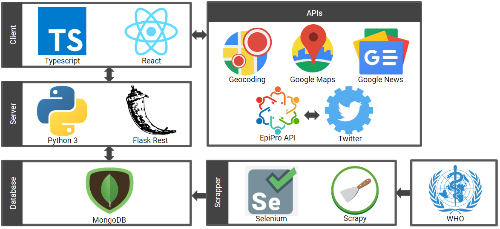

# Final Report
## Requirements
### Search
<table>
    <tbody>
        <tr>
            <th>ID</th>
            <th>Function Requirement</th>
        </tr>
        <tr>
            <td>P1</td>
            <td>Ability to find and access all the disease reports related to given search terms including keyterms, period of interest and location</td>
        </tr>
        <tr>
            <td>P2</td>
            <td>Ability to display found report in user-friendly way</td>
        </tr>
    </tbody>
</table>

### Analytics Platform
<table>
    <tbody>
        <tr>
            <th>ID</th>
            <th>Function Requirement</th>
        </tr>
        <tr>
            <td>A1</td>
            <td>Ability to extract useful data from all disease reports that realted to given search terms</td>
        </tr>
        <tr>
            <td>A2</td>
            <td>Ability to give different forms of visualization of extracted data</td>
        </tr>
        <tr>
            <td>A3</td>
            <td>Ability to examine social media related posts on disease outbreaks over a period of time/geographically</td>
        </tr>
        <tr>
            <td>A4</td>
            <td>Ability to identify particular trends related to a disease outbreak across different sources</td>
        </tr>
    </tbody>
</table>

### Trends Platform
<table>
    <tbody>
        <tr>
            <th>ID</th>
            <th>Function Requirement</th>
        </tr>
        <tr>
            <td>A1</td>
            <td>Ability to integrate data from different sources and present in a user-friendly way</td>
        </tr>
        <tr>
            <td>A2</td>
            <td>Ability to browse news related to a disease outbreak over a period of time/geographically and through keyterms</td>
        </tr>
    </tbody>
</table>

## Use Cases
### API
**API Use Case 1:** Search with keyterms
<table>
    <tbody>
        <tr>
            <th>Actors</th>
            <td>User</td>
        </tr>
            <th>Triggers</th>
            <td>User wants to search the disease reports related to a list of keyterms</td>
        <tr>
            <th>Preconditions</th>
            <td>System generated a list of keyterms for user to choose from.
            User has inputted one or more keyterms from the system generated list, or of their own choice.</td>
        </tr>
        <tr>
            <th>Postconditions</th>
            <td>System generates a list of disease reports related to keyterms</td>
        </tr>
        <tr>
            <th>Normal flow</th>
            <td>System generates list of suggested keyterms.
            User inputs keyterms and activates search.
            System accepts keyterm inputs and generates disease reports related to keyterms.
            </td>
        </tr>
    </tbody>
</table>

**API Use Case 2:** Search with location
<table>
    <tbody>
        <tr>
            <th>Actors</th>
            <td>User</td>
        </tr>
            <th>Triggers</th>
            <td>User wants to search the disease reports related to a geographical location</td>
        <tr>
            <th>Preconditions</th>
            <td>System generated a list of locations for user to choose from.
            User has inputted one or more locations from the system generated list only.
            </td>
        </tr>
        <tr>
            <th>Postconditions</th>
            <td>System generates a list of disease reports related to locations</td>
        </tr>
        <tr>
            <th>Normal flow</th>
            <td>System generates list of locations for user to choose from.
            User inputs locations and activates search.
            System accepts location inputs and generates disease reports related to locations.</td>
        </tr>
    </tbody>
</table>

**API Use Case 3:** Search with period of interest
<table>
    <tbody>
        <tr>
            <th>Actors</th>
            <td>User</td>
        </tr>
            <th>Triggers</th>
            <td>User wants to search the disease reports within a specified time range.</td>
        <tr>
            <th>Preconditions</th>
            <td>System generated default start and end dates.
            User inputs a validated start date and/or end date.
            </td>
        </tr>
        <tr>
            <th>Postconditions</th>
            <td>System generates a list of disease reports within time range.</td>
        </tr>
        <tr>
            <th>Normal flow</th>
            <td>System generates default start and end dates.
            User inputs start date and/or end date, activates search.
            System accepts inputted dates and generates disease reports using the specified time range or default time range.
            </td>
        </tr>
    </tbody>
</table>

### Analytics Platform
**Analytics Use Case 1:** Produce analytics report
<table>
    <tbody>
        <tr>
            <th>Actors</th>
            <td>User</td>
        </tr>
            <th>Triggers</th>
            <td>User wants to see an analytics report based on their criteria</td>
        <tr>
            <th>Preconditions</th>
            <td>System generates disease list for user to choose from.
            System generated default start and end dates.
            User inputs disease, location and time range.
            </td>
        </tr>
        <tr>
            <th>Postconditions</th>
            <td>System generates an analytics report based on user criteria.</td>
        </tr>
        <tr>
            <th>Normal flow</th>
            <td>System generates disease list for user and defaults start and end dates.
            User inputs their criteria, activates analyze.
            System accepts criteria inputs and generates analytic report based on criteria.
            </td>
        </tr>
    </tbody>
</table>

**Analytics Use Case 2:** Produce media coverage frequency graph
<table>
    <tbody>
        <tr>
            <th>Actors</th>
            <td>User</td>
        </tr>
            <th>Triggers</th>
            <td>User wants to see media coverage frequency graph with analytics report</td>
        <tr>
            <th>Preconditions</th>
            <td>System generated default start and end dates.
            User inputs validated start date within the previous 30 days.
            </td>
        </tr>
        <tr>
            <th>Postconditions</th>
            <td>System generates an analytics report based on user criteria.</td>
        </tr>
        <tr>
            <th>Normal flow</th>
            <td>System generated defaults start and end dates.
            User inputs a start date within the previous 30 days, alongside their other criteria.
            System accepts criteria inputs and generates analytics report based with the media coverage frequency graph.
            </td>
        </tr>
    </tbody>
</table>

## System Design & Implementation
### Final software architecture design

Our API and analytics platform architecture perform on the same structures. If these two were to be separate, the analytics platform alone would have very few processes going on in the backend. Therefore, we made the decision to combine the two together, so we did not have to setup another backend for the analytics platform.

Our frontend is controlled using React with Typescript. At the frontend, it is responsible for calling upon the EpiPro API at the backend alongside the other APIs responsible for giving the application statistics for the analytics platform. It performs the call to the APIs with the inputs that are given by the user from the view. Additionally, the frontend processes any data received from the external APIs.

The backend server uses Python3 and Flask on the REST framework. The backend server is mainly responsible for servicing our EpiPro API and its modules. When the frontend calls the EpiPro API using one of its endpoints, it is the backend that processes the inputs and returns the associated results from pulling from our database. The API on the backend has two different types of endpoints – public and private. The public endpoints are available through the access of the API online doc and is used for our search functionality. The private endpoints are not publicly available and is used for our analytics platform functionality.
The scraper uses Selenium and Scrapy in order to do webscraping. It performs on a monthly basis to search and filter through the WHO website as its source. When the scraper finishes accessing and extracting the data, the cleaned data is then stored in our database.

Lastly, the data storage uses MongoDB to operate for our API. This is where our disease report data is updated and cached. It interacts with the backend server in order to handle calls from the frontend and stores the results of the scrapper.

For more information on the details on the API endpoints and the justification of our software architecture, please refer to our [Design Details report](https://github.com/unsw-se3011/SENG3011_EpiPro/blob/master/Reports/Design%20Details.md). If you would like to see how we did our testing in parallel to our software architecture, please refer to our [Testing Documentation report](https://github.com/unsw-se3011/SENG3011_EpiPro/blob/master/Reports/Testing%20Documentation.md).

### Other External APIs used in Analytics Platform

Apart from our own EpiPro API, we have used four other external APIs which can be categorized as the following:
* Data and statistics APIs – this refers to the APIs that are responsible for providing our application data to perform analytic processes e.g. frequency graphs. This includes the Twitter and Google News APIs. Unfortunately, both of these APIs have pricing and request restriction. Therefore, the time range for the data received will on refer to the last month’s worth of tweets or headlines, when these APIs are called.
* Heatmap APIs – this refers to the external APIs that are required in order to process our heatmap on the analytics platform. This involves both the Google Maps and Geocoding APIs. The Geocoding API is responsible for retrieving the global coordinates of a location by name, and Google Maps API is used to show the map of the associated location.

### Summary of Achievements

Our application was able to achieve the requirements that we outlined for ourselves. We were able to develop a scraper that returned processed disease reports in a reasonably coherent form. This was accomplished for the use of Selenium and Scrapy, which, when paired together, allowed us to quickly crawl through both HTML and Javascript driven web pages on the WHO website. We also managed to create a visually appealing UI for our application, which used data from several data sources including WHO, Twitter and Google News. This was made possible by the integration of additional private endpoints to our original EpiPro API and calling upon the other external APIs through the frontend.

## Responsibilities & Organization of team

For this section, please refer to our [Management Information report](https://github.com/unsw-se3011/SENG3011_EpiPro/blob/D4-set-up-markdown-management-info-doc/Reports/Management%20Information.md).

## Project Overview
### Overall Major Achievements

In our opinion, we believe we achieved our project goals and aims to deliver an effective end product. For each deliverable, we not only finished before the deadline, but also put extra effort on achieving extra features that we proposed for our platform. We took into great consideration on what the stakeholders wanted and aimed to reflect their needs on the features that we delivered. 

Therefore, we were able to achieve the following:
* Scrape our data source WHO and extra information to form the required disease reports successfully
* Store pre-processed disease reports into MongoDB database successfully
* Develop and deploy public and private REST API endpoints to query for disease reports and for further analysis
* Develop and deploy a user friendly web application to visualize the collective statistics from disease reports and media coverage in the form of graphs and a heatmap

### Challenges

During the development, the difficulty of some of the components was unexpected. These components tested our problem solving skills and put some pressure on our time management skills.

For example, the most challenging component we encountered would be the web scraping of the data source WHO. There were multiple problems related with the raw data.

Firstly, we were inexperienced with web scraping, and we had to familiarize ourselves with the most common and professional method to use our web scraping tool to crawl the data source correctly. We then needed to analyse the variation of data formats across the different years on the WHO source, and then normalize and unify that raw data. This was a part that we underestimated its difficulty from the beginning, as we did not see the amount and the inconsistency of the raw data from day one. Moreover, the locations identifications also became a problem, as we didn’t have any location data already within the database.

However, with great team effort and engineering skills, we were able to address these problems in a novel way and meet the D2 API deadline.

Another challenge we encountered would be the licencing and pricing restrictions with the Twitter and Google News APIs. Since we preferred not to use the other teams’ APIs, we were required to use either one of these APIs. For the Twitter API, a few of the endpoints that we would have liked to use were restricted to only premium developers who had to pay for its use. Additionally, both the Twitter and Google News APIs restricted the range of archive access to a month for free users. Since this was an issue related to budgeting and general management, we decided to use both APIs in order to produce a sufficient volume of data for the media coverage side of our analytics platform. We also had to limit the media coverage frequency graph to only be shown if the user inputted a start date within the previous 30 days.

A common challenge we encountered would be the team workflow. As we formed the team within a short period, there were lots of collisions in code format editing. We spotted and addressed this issue among our team members and agreed with a common setting for our development.

### Further Improvements

In general, our team utilized each team members unique strengths and skills.
* Chris and Han had their strength in backend development
* Ines had her strength in UX design and frontend UI
* Fiona had experience in full stack development and deployment

This allowed our team’s workflow to run seamlessly, with no pressing issues when it came to time management. If we were to wish which skills we had before the workshop occurred, each of us would wish that we were more well-rounded in the skills that our other team members were more accomplished in.

