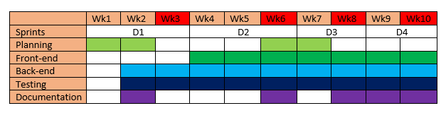

# Management Information
[//]: # (D1, D4)

## Member	Responsibilities

The team roles will be designated as follows:
*	Ines Sarmiento – Project Manager, Product Owner, Front-end Developer
*	Fiona Lin – Scrum Master, Developer, Devops
*	Shenghan Gao – Back-end Developer, Development Tester
*	Yuexuan Liu – Back-end Developer, Development Tester

## Work	arrangements

The project will be conducted using the agile methodology. The start and end of each sprint checkpoint will correlate to each of the four submission deadline checkpoints. This will ensure that there is a working iteration of the project by each deadline date.

During the implementation stage of the API and the main application, the members will focus mainly in the following areas:

*	Ines Sarmiento – front-end development

Based on the end user background and characteristic, develops user interface for our application and achieve our user experience goals. Futhermore, develope tests for relevant system components.

*	Shenghan Gao – back-end development

Focuses on retriving news and articles from the WHO data source, and provides a sophisicated algorithms to extract information and compose the disease report into the designated json format. Additionally, helps develop comprehensive unit tests for the corresponding system components.

*	Yuexuan Liu – back-end development

Mainly in charge of API design and implementation as well as disease reports data storage in mLab. Additionally, develops comprehensive unit tests for each API module.

*	Fiona Lin – full-stack development

In charge of ensuring the streamline workflow of system development life cycle and system features, fixes and updates deployment frequently. Also collaboratively works with all members for continuous deployment.

Team members will be proactive and fulfil their associated tasks before the deadline, as well as assist and collaborate with each other to achieve the perfect completetion of each deliverable. Additionally, all members are required to write up design, documentation and workflow manual for the related system components. Members may also work outside of their areas, if they have fulfilled their tasks early in the sprint or if a task of higher-priority arises.

## Team coordination and communication

Our agile workflow will involve weekly stand-up meetings where we identify what tasks have been completed, what tasks are still in progress, and any obstacles which prevent us from completing our tasks. This will further be facilitated online by the project management application, **Trello** [(our Trello board)](https://trello.com/b/qjgAoQrL/seng3011). Trello will allow the team to observe our work flow and progress within the current sprint. It helps upheld a level of accountability for completing our tasks on time.

Version control within our project will be provided be **Github** and **Git**. This will enable members to work individually on our given tasks through branching, whilst an up-to-date version can be merged into between team members.

We will also use **Slack** as our online communication channel of our current progress. Slack allows the creation of conversation channels for specific members, such as the back-end and front-end development groups. Slack can also be setup to connect to Github, where the channels can be notified of multiple Github events, such as pull requests, CI system and so on.

## Gantt Chart for progression of project

