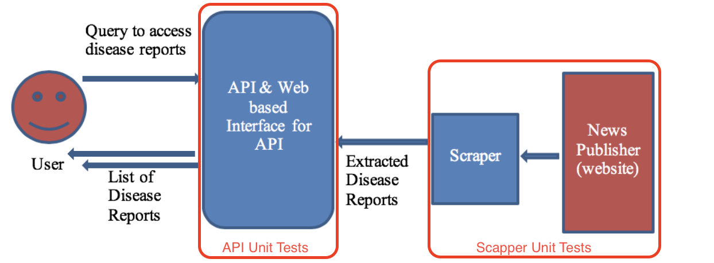

[//]: # ( 3.1. API	Testing D2)
# API Testing

[//]: # ( • Describe	the	testing	processes	used	in	the	development	of API,	referring	to	the	data	and	scripts	included	in	Phase_1	folder.	This	should	describe	your testing	environment	and/or tools	used,	and	limitation e.g.	things	that	are	not	tested.	Describe	your testing	process	i.e.	how	your	team	conducts	testing using	the	test	data	e.g.	in	which	order	and	an overview	of	test	cases,	testing	data	and	testing	results.)
## Testing Processes in Development of API
### Test Processes and Test Environment
During the development, we are going to apply Test-Driven Development(TDD) to ensure the functionalities of each system components. 
Because there are two major components in this stage（see Unit Testing System Components Diagram）, our functional Unit Testings are composed of API Unit Testing and Scraper Unit Testing.
 
#### API tests
API Unit tests in `PHASE_1/API_SourceCode/test_main.py` file will test each API endpoint comprehensively and extensively, that means not only the expected successful test cases but also the invalid input test cases. We collect the sample output based on our project specification and the specification repository in GitHub for test expected output into our sample test data files.  And testing the API endpoint response against our expected sample output files. Sample disease report data is located in `PHASE_1/TestScripts/sample_output/sample_disease_report.json` and the key terms data can be found in `PHASE_1/TestScripts/sample_output/key-terms.json`, as well as the locations data is in `PHASE_1/TestScripts/sample_output/locations.json`. Since those API endpoints are exposed to the public world and it will receive any kind of requests that will harm the backend server. Therefore, it should ensure the API request won't cause any internal server error.

We also test our date helper functions, those tests are in the `PHASE_1/API_SourceCode/test_date.py`. Because the start date and end date has special requirements, so it needs some extra functions to process the dates input. Those functionalities have been tested throughout.
For simplicity, we leave the pytest script `test_<main/date>.py` in `PHASE_1/API_SourceCode` and the unit-test running script `unit-test.sh` in `PHASE_1/TestScripts`. The pytest script will import `maim.py` to create the test application instance as the test_client to test with.
To use `unit-test.sh` see below example:
  * test all
  ```bash
  ./unit-test.sh
  ```
  The tests will show below output
  ```
  ************ test main ************
## test_invalid_param
## test_general_key_terms
## test_specific_key_terms
## test_specific_w_category_none_key_terms
## test_specific_w_category_A_agents_key_terms
## test fetch all locations
...
************ test date ************
....
 ```
 * only test main
  ```bash
  ./unit-test.sh main
  ```
  The test will show below output
  ```
  ## test_invalid_param
  ## test_general_key_terms
  ## test_specific_key_terms
  ## test_specific_w_category_none_key_terms
  ## test_specific_w_category_A_agents_key_terms
  ## test fetch all locations
  ## test_get_location_by_area
  ## test_loc_invalid_param
  ## test_fetch_all_reports
  ## test_fetch_all_report_w_valid_limit
  ## test_fetch_all_report_w_valid_start_at1
  ```

#### Scraper tests
Scraper Unit Tests will test the functionalities as well as the correctness. Utilising the url of the article as test input and the sample disease report data(sample_disease_report.json) from the project specification as the expected output in testing the developed the web scaping. In this phase of development, Scraper correctness and functionalities are more vital to the project scope and definition. Thus, we follow the project requirements and pre-defined input in project specification as well as the expect sample output to ensure our web Scraper meet the requirements.
#### CICD tests
  CICD has set up within GitHub and Travis, and `.travis.yaml` has developed to watch every push to git repository and only the `production` branch will trigger the build and deploy to the production site in Google Cloud Platform.

  The CICD process consist of test our API with all unit tests in the production virtual environment. After the tests passed, it will deploy the api source code to the production site.

  More detail please refer to the section [Testing and CICD of Design Detail](https://github.com/unsw-se3011/SENG3011_EpiPro/blob/master/Reports/Design%20Details.md#testing-and-cicd)
### Test tools
 Unit Testing will be developed and run against each build. Those tests are required for each function of APIs and Scraper within our web server and will be developed with Pytest. Since Pytest is the Flask built-in test framework. It will help us to bring up a test instance of our system and do the tests on different developing system components.

### Limitation and Exception 
 Since the time constraint of the project, there are few things out of our test scope as follows:
 * API efficiency and performance

 As a third party database is used for development, we exclude performance test for data query from the database. Also testing on a query from an external database is not as part of the project scope. As well as the latency occurs on external data fetch is not part of our test scope.
 * Scraper performance and efficiency and regression analysis
 
 Since we are still in the development phase and everything has not been functioning properly, there is not much meaning for testing the performance and efficiency as well as the regression testing. Those testing results will get skew based on the incorrectness of the web scraping and/or other factors.


[//]: # ( • Describe	the	output	of	testing	and	what	actions	you	took to	improve	the	test results. At	D2	your	Phase_1/TestScripts	folder	should	contain:)
[//]: # (1. Test	input	files	)
[//]: # (2. Test	configuration	files	if	any)	
[//]: # (3. Result	files	if	any)
[//]: # (4. Software	or	scripts	used	during	testing	if	any)


[//]: # (3.2. Platform Testing D4)
[//]: # (• Describe	the	testing	processes	used	in	the development of	the	platform.	You	may	include	a	sub-folder	in	Phase_2	folder	to	include	any	data,	scripts	you	used	to	test	the	platform. • Describe	the	output	of	testing	and	what	actions	you	took	to	improve	the	test results.)
